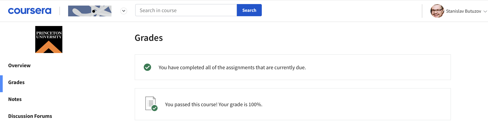

 

### Overview
Repository contains solutions to programming assignments for the course **"Computer Science: Programming with a Purpose"**.  
The [<ins>course</ins>](https://www.coursera.org/learn/cs-programming-java) is offered by a Princeton University on [<ins>Coursera</ins>](https://www.coursera.org/) education platform.  
Course does not assume earn a certificate upon completion.

---
#### Programming assignments specifications
- [<ins>Week 1</ins>](https://coursera.cs.princeton.edu/introcs/assignments/hello/specification.php) – **Hello, World**
- [<ins>Week 2</ins>](https://coursera.cs.princeton.edu/introcs/assignments/loops/specification.php) – **Loops and Conditionals**
- [<ins>Week 3</ins>](https://coursera.cs.princeton.edu/introcs/assignments/arrays/specification.php) – **Arrays**
- [<ins>Week 4</ins>](https://coursera.cs.princeton.edu/introcs/assignments/io/specification.php) – **Input and Output**
- [<ins>Week 5</ins>](https://coursera.cs.princeton.edu/introcs/assignments/functions/specification.php) – **Functions**
- [<ins>Week 6</ins>](https://coursera.cs.princeton.edu/introcs/assignments/recursion/specification.php) – **Recursion**
- [<ins>Week 7</ins>](https://coursera.cs.princeton.edu/introcs/assignments/performance/specification.php) – **Performance**
- [<ins>Week 8</ins>](https://coursera.cs.princeton.edu/introcs/assignments/oop1/specification.php) – **Using Data Types**
- [<ins>Week 9</ins>](https://coursera.cs.princeton.edu/introcs/assignments/oop2/specification.php) – **Creating Data Types**
- [<ins>Week 10</ins>](https://coursera.cs.princeton.edu/introcs/assignments/barchart/specification.php) – **Bar Chart Racer**

---
#### Notes
All samples of code had been writing in programming environment by Princeton University (including OpenJDK, IntelliJ IDEA CE, associated command-line tools, and the input and output standard libraries ([<ins>stdlib.jar</ins>](https://introcs.cs.princeton.edu/java/stdlib/)) that accompany this course – choice options during installation). Links for download below.  
**Warning! Installation can overwrite your shell configuration file!**  

- [<ins>macOS</ins>](https://lift.cs.princeton.edu/java/mac/)
- [<ins>Windows</ins>](https://lift.cs.princeton.edu/java/windows/)
- [<ins>Linux</ins>](https://lift.cs.princeton.edu/java/linux/)

---
#### Accomplishments
 